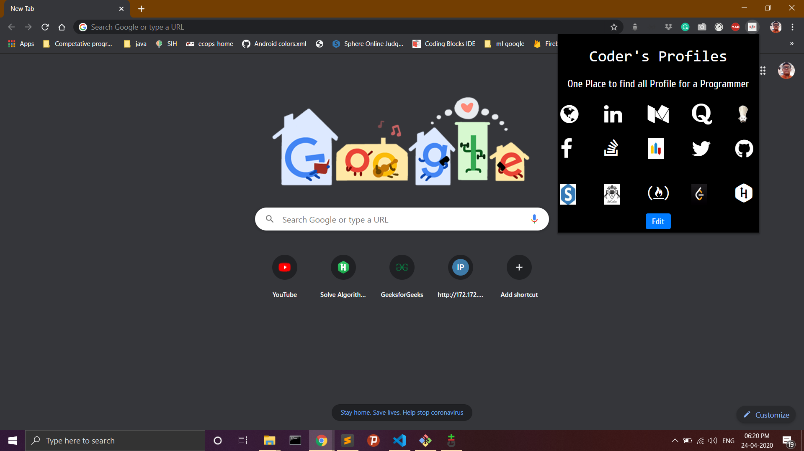
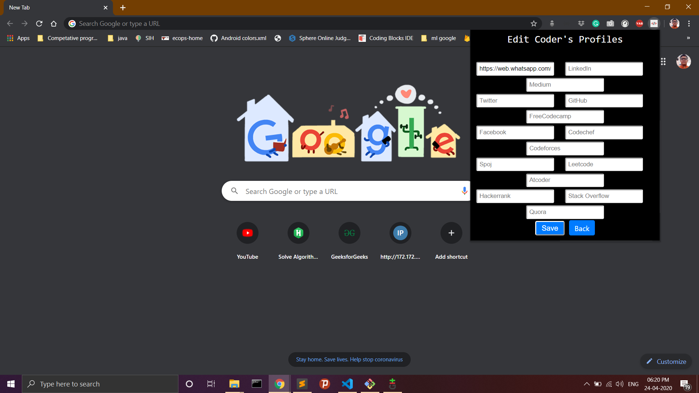

# Coder's Profiles

<p align="center">
  <a href="https://github.com/ksdkamesh99/Coders-Profiles">
    
  </a>

## 📌 Introduction

A Google Chrome Extension Developed for mainly programmers and coders to store all there programming and social handles at one place.Use this extension and find all required handles at one place.  

## 🏁 Sites there in this extension

* [Your Portfolio]()
* [Linkedin](https://www.linkedin.com/)
* [Medium](https://medium.com/)
* [Quora](https://www.quora.com/)
* [Codechef](https://www.codechef.com/)
* [Facebook](https://www.facebook.com/)
* [Stackoverflow](https://stackoverflow.com/)
* [Codeforces](https://codeforces.com/)
* [Twitter](https://twitter.com/)
* [Github](https://github.com/)
* [Spoj](https://www.spoj.com/)
* [Atcoder](https://atcoder.jp/)
* [FreeCodeCamp](https://www.freecodecamp.org/)
* [LeetCode](https://leetcode.com/)
* [Hackerrank](https://www.hackerrank.com/)


## 🏃‍♂️ Local Installation

1. Drop a ⭐ on the Github Repository. 
2. Clone the Repo by going to your local Git Client and pushing in the command: 

```sh
https://github.com/ksdkamesh99/Coders-Profiles.git
```

3. Extract the Zip File(coder's profies.zip).  
4. Now go to Google Chrome and open extensions and On Developers Mode.  
5. Upload the folder in upload unpacked.  
6. Now click on extension and click on edit and upload the links of your handles.  
7. Click on save and enjoy my extension.  

## 🏃‍♂️ Pictures of Extension:



## 📜 LICENSE

[MIT](https://github.com/ksdkamesh99/Coders-Profiles/blob/master/LICENSE)
